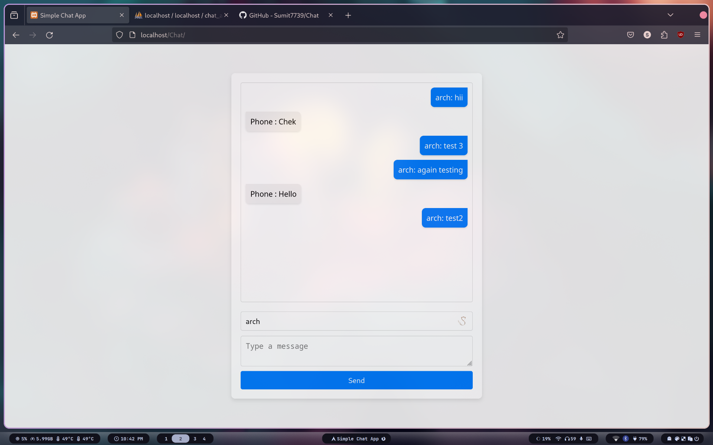

# Simple Chat App

A simple chat application built with HTML, CSS, JavaScript, PHP, and MySQL. This app demonstrates basic CRUD operations and real-time chat functionality.

## Features

- Real-time chat with auto-refresh every 3 seconds.
- Differentiates messages by user with distinct colors and alignment.
- Google Material Design-inspired interface.

## Prerequisites

- A web server with PHP support (e.g., XAMPP, WAMP, LAMP).
- MySQL database.

## Installation

1. **Clone the repository or download the files:**

   ```bash
   git clone https://github.com/yourusername/simple-chat-app.git
   cd simple-chat-app
   ```

2. **Set up the database:**

   - Open your MySQL database client (e.g., phpMyAdmin).
   - Create a new database called `chat_app`.
   - Run the following SQL script to create the `messages` table:

     ```sql
     CREATE DATABASE chat_app;

     USE chat_app;

     CREATE TABLE messages (
         id INT AUTO_INCREMENT PRIMARY KEY,
         user VARCHAR(255) NOT NULL,
         message TEXT NOT NULL,
         timestamp TIMESTAMP DEFAULT CURRENT_TIMESTAMP
     );
     ```

3. **Configure the database connection:**

   - Open `db.php` and update the database credentials if necessary:

     ```php
     <?php
     $servername = "localhost";
     $username = "root";
     $password = "";
     $dbname = "chat_app";

     $conn = new mysqli($servername, $username, $password, $dbname);

     if ($conn->connect_error) {
         die("Connection failed: " . $conn->connect_error);
     }
     ?>
     ```

4. **Deploy the application:**

   - Place the project files in your web server's root directory (e.g., `htdocs` for XAMPP).
   - Ensure your web server is running.

5. **Access the chat application:**

   - Open a web browser and navigate to `http://localhost/simple-chat-app/index.html`.

## File Structure

```
simple-chat-app/
├── db.php
├── fetch_messages.php
├── index.html
├── post_message.php
├── script.js
└── style.css
```

## Description

- **db.php**: Handles the database connection.
- **fetch_messages.php**: Fetches messages from the database.
- **post_message.php**: Posts new messages to the database.
- **index.html**: Main HTML file that contains the chat UI.
- **style.css**: CSS file for styling the chat application.
- **script.js**: JavaScript file for handling dynamic functionalities.

## Usage

1. **Enter a username** in the input field at the bottom of the page.
2. **Type your message** in the textarea provided.
3. **Click "Send"** to post your message to the chat.
4. Messages will be updated every 3 seconds automatically.


Images
Here are some screenshots of the chat application:


Chat interface with real-time messages.




<!-- User message highlighted in blue.
 -->


## License

This project is licensed under the MIT License. See the LICENSE file for details.

## Acknowledgments

- Google Fonts for typography.
- Inspiration from Google Material Design principles.
